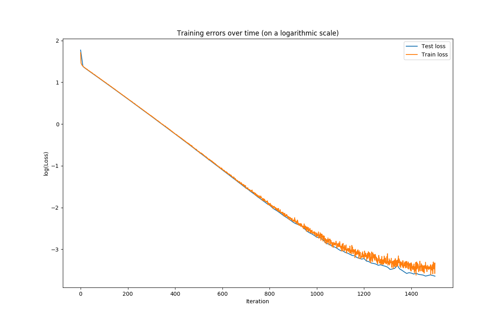
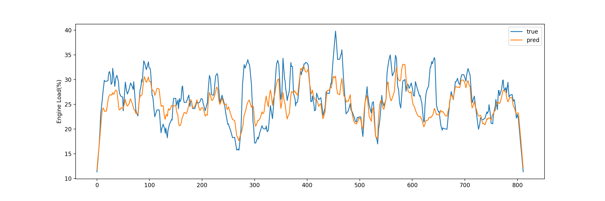
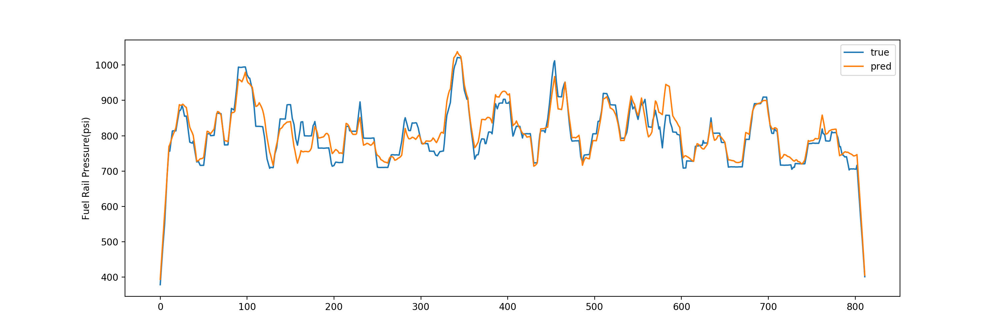
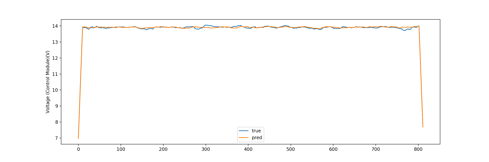
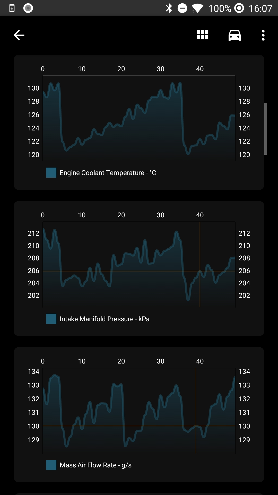

# Android Developer Challenge (#AndroidDevChallenge) - Submission One
 
## Tell us what your idea is.
 
An android app that detects if your car's engine (combustion or electric) is running correctly, and if not, it will tell you what is wrong. Simply to create TensorFlow models of all car engines and use them on android phones to detect problems before becoming disasters, to diagnose problems, or to monitor changes like the effect of new tires on the car efficiency.
 
### A short background
 
All cars include gas cars, hybrid cars, diesel cars, and electric cars that produced after 2001 have an Onboard Diagnostics (OBD) port under the dashboard. And YES! Tesla cars have it too! The port can be used to request data from the car in form of [Parameter IDs (PIDs)](https://en.wikipedia.org/wiki/OBD-II_PIDs), using specific interfaces. These interfaces are widely available and can be found on Amazon from less than [$10](https://www.amazon.com/Mestart-OBDII-OBD2-Bluetooth-Car/dp/B01HXGX8V6/ref=pd_bxgy_263_2/147-8614772-2826736?_encoding=UTF8&pd_rd_i=B01HXGX8V6&pd_rd_r=37ba8a02-0d08-4531-b3fb-794a36748de6&pd_rd_w=fvG9f&pd_rd_wg=b5cIU&pf_rd_p=09627863-9889-4290-b90a-5e9f86682449&pf_rd_r=BVVQZEJQG1BKE6HAW0J0&psc=1&refRID=BVVQZEJQG1BKE6HAW0J0) for Chinese clones to almost [$100](https://www.amazon.com/dp/B00H9S71LW/ref=psdc_15707381_t4_B07JFRFJG6) for known brands. Finally there are [Android apps with more than 10,000,000 downloads on Google Play Store](https://play.google.com/store/apps/details?id=org.prowl.torquefree&hl=en) that can utilize these interfaces to communicate with the car. This combination is very popular and accessible, and has been used by mechanics, car enthusiasts, do-it-yourselfers, and even by industries like insurances.
 
### So, what is the problem?
 
The problem with most of these apps are that they can show you lots of data, but they do not tell their users what the acceptable range for each of the parameters is considering the values of other parameters. Even the mechanics should have a lot of experience or have access to manufacturer technical bulletins to make sense of the data. Although most of the times these documents can be bought from manufacturers (except for Tesla), but they can be very expensive considering the number of car brands, models, and years of production.
 
But this can solve these problems and much more. It is not only useful for enthusiasts, or mechanics, or industries, but also can really be helpful to people that does not know anything about the cars. For instance, last month, my wife was driving our car, and all of a sudden, the dashboard turned off, and she could not move the steering wheel, but the engine was running. She could not change lanes. It was terrifying and very dangerous. We were lucky that she was not driving too fast and we finally managed to stop and tow the car to the dealership. The problems were battery and alternator. They were degraded over time and we did not notice the missing 1 or 2 volts. If we have had this app installed, it would have been notified us about abnormal voltages under different loads.
 
With this app drivers can use the data from the others to diagnose their own cars and use the data from own car to detect the changes. For instance, has the new additive improved my car efficiency? or has the new route to work put more load on my car and decrease the car efficiency?
 
### How the app will work?
 
A common workflow for the app would be that:
 
- The user connects the obd2 interface to the car.
- The user pair the phone with the adapter using the app. This is very similar to the way drivers connect their phone to the car's infotainment system.
- The user adds a new car (year, make, model) inside the app.
- If there are any models for the car on the server, the app will download it, so it can be used offline.
- The app will automatically connect to the engine and start extracting data. User can monitor each engine parameters in a separate line chart (like stock market apps). if there is already a model on the device, the charts show two lines, one representing the values from the car and the other representing the expected values.
- The app will also transmit the engine data to server, so we can create new models, or improve existing models using [transfer learning](https://www.tensorflow.org/lite/models/object_detection/overview). It is worth noting that:
   - All data are anonymous.
   - The users will be notified to download updated models.
   - We can include some additional parameters to improve the accuracy of the model like temperature, humidity, wind direction, car moving direction, city, country, road include grade, and more.
   - The app does not need to be connected to the internet all the time, trip data will be collected offline and will be transmitted to server as soon as the user connects to WiFi. This is also the common behavior of the Firebase Android SDK.
- Users can:
   - use an app like a multimeter and look at the charts and see if any of the parameters are out of range.
   - or they can be notified if the difference between data coming from the engine and the expected values passed a certain threshold, so they do not need to be inside the app all the time. This means that if users want to monitor parameters they can go to the app, otherwise they just leave the OBD2 interface connected to the car and the app will notify them of any anomaly.
 
The app will be an Android app that supports phones and tablets, but it will be very useful/cool if we can include this app on the [Android auto](https://www.android.com/auto/) as well.
 
## Tell us how you plan on bringing it to life.
 
### The Timeline
 
One of the major challenges of this app is to communicate with the car to fetch the data from engine computer using an OBD2 adapter. I already have experience working on similar Android apps on the Google Play Store with more than 100K installs and 50K active users. So, I already have a functional Android app and I will send a demo video of it with my final submission. I also have created the main chart component for this project. The major parts that are remaining are as follows:
 
 #### December 2019
- UI/UX Design: The app will roughly have 4 screens. I will try to use [Google Materiel Design](https://material.io/design/) as well as [ML Kit Showcase App with Material Design](https://github.com/firebase/mlkit-material-android) and [Patterns for machine learning-powered features](https://material.io/collections/machine-learning/).

#### January 2020:

- AI: This will be the biggest part of the app. This will take 4 weeks. I will use a [TensorFlow based solutions for mobiles from Google](https://www.tensorflow.org/lite). I can break down this step into three major parts:
 
   - Dataset Preparation: when the app connects to the car, it starts to fetch all the available parameters from the car's engine. The frequency of this operation is depending on the OBD2 interface and the protocol that car supports. Based on my past experience, the minimum speed is 4 data points per second and the maximum speed is 60 data points per second. Depending on the user's permission, the app may include more information such as temperature, humidity, wind direction, car moving direction, city, country, road include grade. The app will record these data on text files and sync it to Firebase Storage at the appropriate time.
 
   - Training: I have been working on a sequence to sequence model with python. On the plot Below, I compare the Train and Test loss on each iteration of one of the  trainings.

   Below, I use the model to predict values for dome of the engine parameters from the test set. Then I inverse original scale of our data. You can see a comparison of true and predicted labels on the charts below.
   

   

   

   
   I have to experiment with it a bit more. When I finalize the model python code, I can use [Google Cloud Platform](https://cloud.google.com/ml-engine/docs/tensorflow/getting-started-training-prediction), to train a new engine model or retrain an existing engine model. I believe I need to train models for every new car based on its make, model, model year, and city. I also have to convert the models into a compressed flat buffer one with the TensorFlow Lite Converter.
 
   - Hosting the models: I will host the models on Firebase. When users add a new car, if the model for that car is available, the app will download that model. Besides, at any time, if I upload a new TensorFlow Lite model, the app will download the new model and start using it when the app restarts.
 
#### February 2020 :
- Bootcamp at Google: By this time I have the design, a mockup, and the model. 

#### March & April 2020 :

- Backend: Because the data are anonymous and there will be user login for now, all the backend code are relating to AI, which I have already explained.

- Mobile Apps: I will use Kotlin for this project. As I mentioned before I already have implemented the parts that communicate with the car. I also implemented the chart. I need to add screens to manage the car profiles and show real time data. This will take 3 to 5 weeks.

- As you can see these steps will roughly take 7 weeks. As I will use the remaining time to further improve the app, or improve the models, or adding new models.

#### May 2020 :

- Release: Mostly to prepare the store listing, including the app icons,  the screenshots, the descriptions and the rest.

 
 
 
### Google’s help
 
The Google can help me with dataset preparation, training, and everything relate to them. For instance, how can I use the technique known as [transfer learning](https://www.tensorflow.org/lite/models/object_detection/overview) with [the Cloud Platform UI](https://cloud.google.com/vision/automl/object-detection/docs/edge-quickstart) to use a [starter model](https://www.tensorflow.org/lite/models/object_detection/overview#starter_model). Besides, I only have a MacBook pro, and I do not have access to a system with a good GPU for training. It would be great if I could be able to use Google AI Platform on GCP and Firebase to implement this project. Finally, Google can help me reach out to much more people, and that means better data, which ultimately translate to a better app.
 
## Tell us about you.
 
I have a bachelor’s degree in computer engineering and my master’s studies was on Informatics engineering. My thesis project was about biologically inspired computer vision, so I have a different (good) understanding on deep learning that was inspired by perception in the human visual system.
 
I started working at the software development companies, writing FoxPro and Visual Basic code, when I was a sophomore in high school. Professionally, I have more than 10 years of experience in software development. I have more than 5 years of experience in mobile development working on 7 Android and 3 iOS apps.
 
Currently I am the Mobile Team Lead at an international company in Europe. We are a team of 19 developers across all areas, 4 of whom are mobile developers. I am managing the mobile team and responsible for 4 projects which includes 7 applications. I am still enjoying writing mobile and backend codes every chance I get in the following areas: DevOps (Microsoft TFS, Git, Jenkins Automated UI Testing), Mobile Development (Flutter, IOS(SWIFT), Android(Kotlin, Java)), JavaScript (Node.js), Databases(SQL, NoSQL), Cloud Computing (Azure, Firebase, AWS), AI (TensorFlow, Image Processing (OpenCV)).

